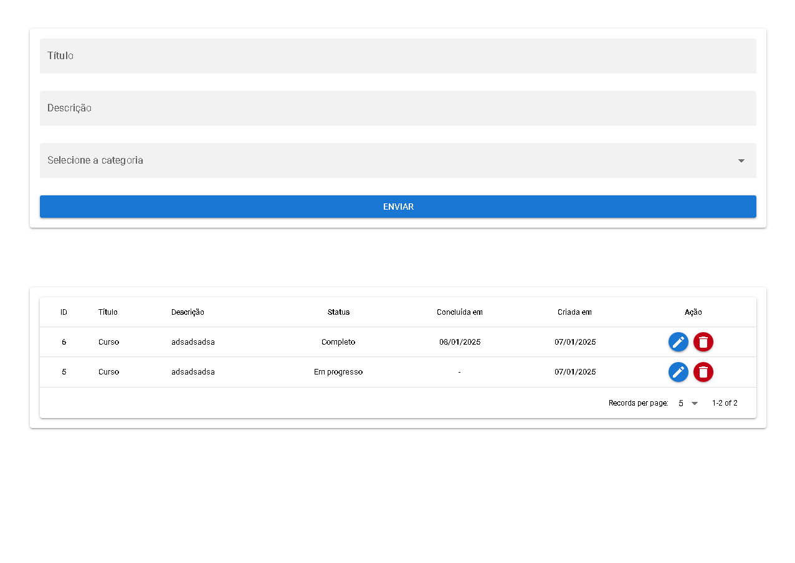

# ToDo List (web)

Uma plataforma para manter suas tarefas organizadas e gerenciar seu tempo de forma mais produtiva. Com uma interface limpa e fácil de usar



## Como rodar o projeto

Você vai acessar o diretório do FrontEnd

```bash
cd softpar/web
```

Instale as dependências do Quasar

```bash
npm install
```

### Inicie o servidor de desenvolvimento

```bash
npx quasar dev
```
